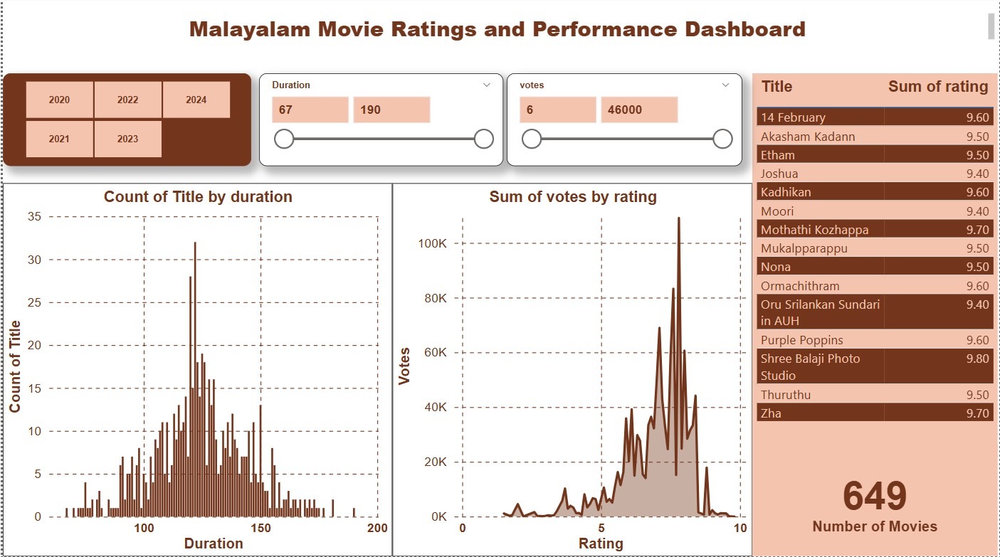
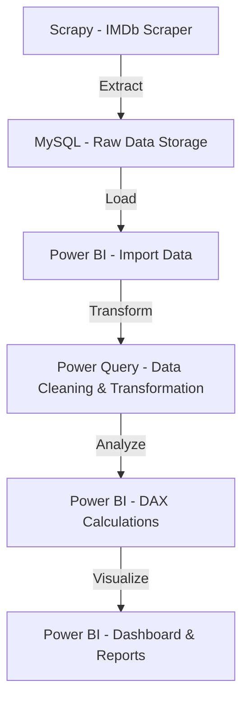

# Malayalam Movie Data Scraper and Analyzer

## Overview

This project utilizes Scrapy to scrape Malayalam movies from IMDb, stores the extracted data in a MySQL database, and enables data analysis using Power BI.
The goal is to provide insights into Malayalam movie trends, ratings, and other relevant metrics.

## Features

- **Data Scraping**: Scrapes Malayalam movie data from IMDb
- **Data Storage**: Stores the scraped data in a MySQL database for easy access and analysis.
- **Data Analysis**: Enables visualization and analysis of movie data using Power BI.

## Technologies Used

- **Programming Languages**: Python
- **Frameworks**: Scrapy
- **Database**: MySQL
- **Data Visualization**: Power BI
- **Environment Management**: Virtual Environments, dotenv

## Setup Instructions

### 1. Create a Virtual Environment

Create and activate a virtual environment to manage dependencies:

For Windows:

```
python -m venv scrapy_env
source scrapy_env/Scripts/activate
```

For macOS/Linux:

```
python -m venv scrapy_env
source scrapy_env/bin/activate
```

### 2. Install Required Packages

Install the necessary Python packages:

```
pip install scrapy mysql-connector-python python-dotenv
```

### 3. Set Up MySQL Database

Use the create_database.sql script to set up your MySQL database.
This script will create the necessary table for storing Malayalam movie data.

### 4. Configure Environment Variables

Create a .env file in the root directory to store your MySQL credentials:

```
MYSQL_HOST=your_mysql_host
MYSQL_USER=your_mysql_user
MYSQL_PASSWORD=your_mysql_password
MYSQL_DATABASE=your_mysql_database
```

### 5. Run the Scraper

Execute the spider to start scraping data from IMDb:

```
cd .\imdb_scraper\imdb_scraper\
scrapy crawl imdb_spider
```

### 6. Data Analysis

The analysis of the scraped data is done in Power BI Desktop.
Additionally, the Power BI report includes a feature that allows users to dynamically adjust the weighting of votes and ratings.
This is implemented using a slider where users can modify the value of 'a' (weighting parameter) in the formula
This enables a more flexible analysis of movie performance based on user preferences.

#### Implementing Normalized Weighted Rating

While analyzing the data, we observed that higher-rated movies tend to have fewer votes,
which led to the conclusion that IMDb ratings alone cannot be used as the sole measure of determining the best movies.
To address this, we introduced the concept of Normalized Weighted Rating.

```
Normalised Weighted Rating =
Parameter[Parameter Value] * DIVIDE(SUM('imdb movies'[votes]), CALCULATE(MAX('imdb movies'[votes]), ALL('imdb movies')), 0) +
(Parameter[Parameter Value] - 1) * DIVIDE(SUM('imdb movies'[rating]), CALCULATE(MAX('imdb movies'[rating]), ALL('imdb movies')), 0)
```

- The first term normalizes the number of votes by dividing each movie's vote count by the highest vote count in the dataset.

- The second term normalizes the IMDb rating in a similar manner.

- The user-defined parameter (weighting parameter) Value allows for dynamic control over the influence of each metric.
  When set to 0.5, votes and ratings are equally weighted.
  This formula normalizes both the vote count and the IMDb rating before applying a weight, ensuring that neither factor dominates the final ranking:

  Below is a sample dashboard:
  <br>
  

📊 Power BI Report: You can find the full Power BI report in Data_Analysis.pbix for further exploration.

## ⚙️ ETL Pipeline Workflow



## Contribution

Feel free to contribute to this project by submitting issues or pull requests.
